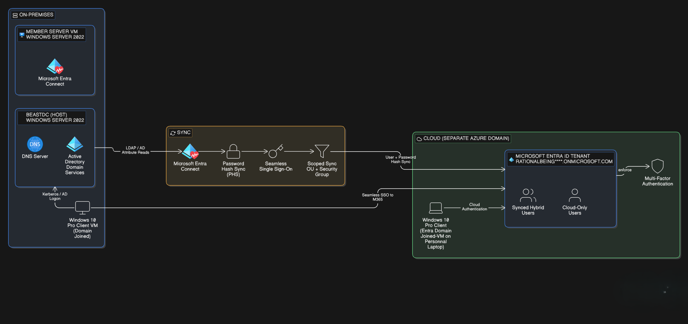

* Environment overview (DC, Member Server, Entra tenant)
* Identity flow (AD → Entra via Entra Connect Sync)
* OU / Group scoping approach (why you avoided full sync)

# Architecture Overview

## Environment Summary (Hybrid Identity Lab)

This lab simulates a common enterprise hybrid identity deployment where on-premises Active Directory remains the authoritative identity source and Microsoft Entra ID is used for cloud authentication.

### On-Premises (Hyper-V Host: BEASTDC)
- **Windows Server 2022 Domain Controller**
  - Roles: AD DS, DNS
  - Domain: `YKT.dhruv`
- **Windows Server 2022 Member Server VM**
  - Microsoft Entra Connect (Sync) installed
- **Windows 10 VM (Test Client)**
  - Domain-joined workstation used to validate authentication and name resolution

### Cloud
- **Microsoft Entra ID Tenant**
  - Primary domain: `rationalbeing33**outlook.onmicrosoft.com`

---

## Synchronization + Authentication Model

### Synchronization
- Microsoft Entra Connect configured with:
  - **Password Hash Synchronization (PHS)**
  - **Scoped sync** using **OU filtering + security group filtering**
- Only selected users in the dedicated OU and security group are synchronized to Entra ID to simulate a staged rollout.

### Authentication
- **Seamless SSO enabled**
- Domain-joined users access cloud resources (ex: Microsoft 365) without repeatedly entering credentials, relying on Kerberos-based SSO in the hybrid setup.

---

## Key Dependencies
- **DNS**
  - Domain Controller DNS is authoritative for the internal zone (`YKT.dhruv`)
  - DNS forwarders used for external name resolution (Microsoft endpoints)
- **Time**
  - A correct time hierarchy is required for Kerberos and certificate-based authentication
  - Time skew caused AAD connector authentication failures (documented in Troubleshooting Log)
 
  ## Diagram
 

![Hybrid Identity Architecture]
